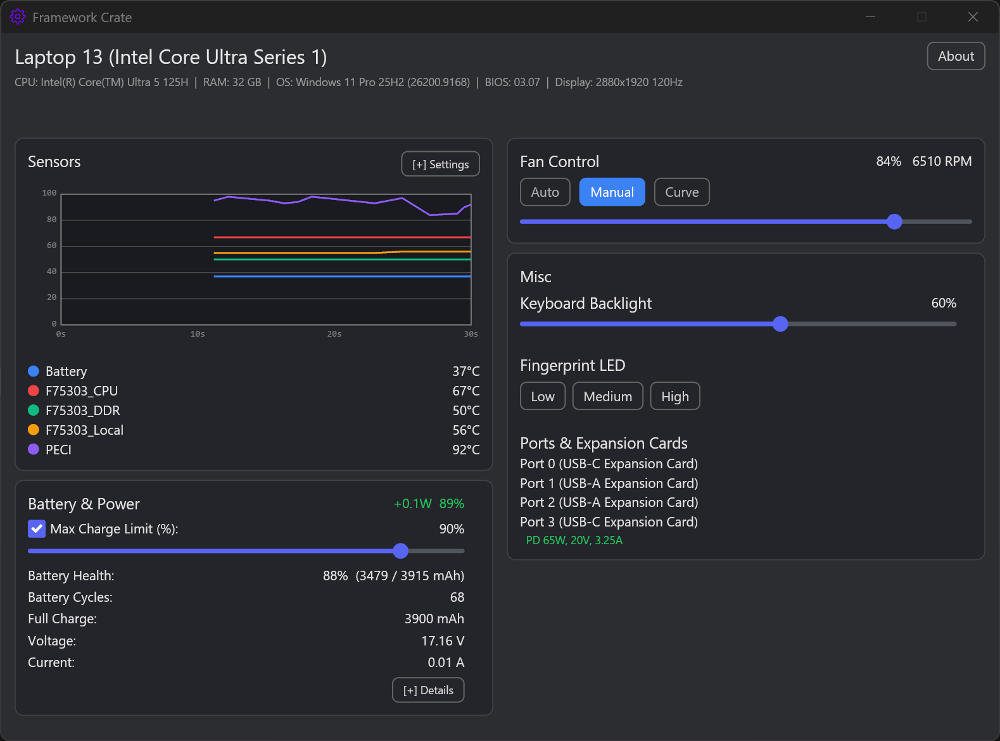

# Framework Crate (Windows)

A native desktop GUI for Framework laptop fan control, battery charge limits, and live hardware telemetry. Built with Rust and [Iced](https://iced.rs/) 0.14, using [`framework_lib`](https://github.com/FrameworkComputer/framework-system) for direct EC hardware access.

Inspired by [ozturkkl/framework-control](https://github.com/ozturkkl/framework-control).

## Screenshot



## Features

- **Fan Control** — Auto (firmware), manual (0–100% duty, optional per-fan), and curve mode with sliders (default 5 points, hysteresis, and rate limiting)
- **Battery Management** — Maximum charge limit (25–100%) with enable/disable toggle; saved limit is applied on startup. Health uses last-full / design capacity
- **Live Telemetry** — Real-time temperature chart (30s sliding window), per-sensor display with colored indicators, and fan RPM in the header
- **Misc Panel** — Keyboard backlight slider, fingerprint LED level, expansion card, and USB-C / HDMI / DP port classification
- **CPU Power** — Intel CPUs only. Read/write PL1/PL2 via PawnIO (optional; SHA-256 verified module download). AMD and other vendors are not supported.
- **About Page** — Hardware info (CPU, RAM, display, BIOS) and software settings (poll rate, refresh interval)
- **System Tray** — Minimize to tray, tray icon with context menu (Show / Quit)

## Requirements

- **Platform**: Intel Core Ultra Series 1 (Meteor Lake) — only tested and supported on this platform
- Windows 10/11
- Administrator privileges (required for EC access)

## Build

```bash
cargo build --release
```

## Binary Size Checks

```powershell
# Debug build (larger because it keeps unoptimized code and full debuginfo)
cargo build
Get-Item .\target\debug\framework-crate.exe | Select-Object Name,Length

# Release build (smaller and suitable for distribution)
cargo build --release
Get-Item .\target\release\framework-crate.exe | Select-Object Name,Length

# Compare debug and release builds in one command
cargo build; Get-Item .\target\debug\framework-crate.exe | Select-Object Name,Length; Get-Item .\target\release\framework-crate.exe | Select-Object Name,Length
```

Notes:

- `debug` builds are intentionally larger because they keep full debug symbols and unoptimized code.
- Use `release` artifacts for packaging and distribution.
- If shipping a bundle, do not include the entire `target/` folder or `.pdb` files unless you need them for debugging.

## Run

```bash
# Must run as administrator
cargo run --release
```

## Architecture

```
src/
  main.rs              — Iced 0.14 application entry point, boot function
  app.rs               — App struct, Message handlers, mutate_config helper
  sub_state.rs         — AppState groups (fan, thermal, peripherals, battery, system, lifecycle)
  views.rs             — UI layout (sensors, fan control, battery, misc, settings)
  types.rs             — Config structs, FanControlMode, CurveConfig, validation
  style.rs             — Colors, fonts, layout constants
  config.rs            — TOML config load/save (atomic write via tmp+rename)
  config_save_task.rs  — Debounced config save (100ms) with battery apply
  background_task.rs   — EC polling loop, fan control, expansion/PD scans
  cpu_power.rs         — PawnIO RAPL read/write (PL1/PL2) and sync thread
  temp_chart.rs        — Canvas-based temperature line chart (30s history)
  curve_canvas.rs      — Canvas-based fan curve visualization
  fan_control.rs       — CurveStepper, rate limiting, duty calculation
  system_info.rs       — Windows API FFI (CPU, RAM, OS, display, tray)
  probe.rs             — HeightProbe widget for dynamic window sizing
  util.rs              — Time utilities, lock helpers (read_lock, with_write_lock)
  cli/                 — EC wrapper only (not a command-line interface)
    ec_wrapper.rs      — EcClient wrapper around framework_lib's CrosEc
    mod.rs
  tray/
    mod.rs             — TrayManager (Windows tray icon)
    event.rs           — TrayIcon events
    message_pump.rs    — Dedicated message pump thread for tray icon
```

### Data Flow

```
framework_lib (CrosEc) → background_task → Arc<RwLock> → UI (view reads)
                                   ↕
                            config_save_task → config.toml
```

- **Hardware access**: `framework_lib` crate calls EC directly via kernel driver (no subprocess)
- **Config**: `dirs::config_dir() / framework-crate/config.toml`
- **Background polling**: tokio task on LP-E core, 200ms–2s interval (idle slowdown)
- **UI refresh**: self-rescheduling tick (50–1000ms), idle 1s, hidden 500ms
- **Lock strategy**: `Arc<RwLock<Arc<T>>>` for shared state, narrow lock scope (<1µs)
- **State organization**: `AppState` split into `FanState`, `ThermalState`, `PeripheralState`, `BatteryState`, `SystemState`, `LifecycleState`, plus `CpuPowerState`

### Performance Optimizations

- `EcClient` is shared via `Arc` — no hardware re-initialization on clone
- `ThermalData.temps` uses `Arc<BTreeMap>` — history samples share data
- `SensorCache.sorted/colors` uses `Arc<Vec>` — zero-copy per UI tick
- Config locks are held for less than 1µs by reading only the needed fields and dropping immediately
- `curve_full_points` is debounced (100ms after the last slider edit)
- PD port history is pushed only when data changes
- The fan curve keeps running during idle periods to maintain temperature response
- The `mutate_config` helper reduces boilerplate for config mutations

## Configuration

Config file location: `%APPDATA%/framework-crate/config.toml`

```toml
[fan]
mode = "curve"  # "disabled" | "manual" | "curve"
unified_duty = true
per_fan_duty = []

[fan.manual]
duty_pct = 50

[fan.curve]
poll_ms = 500
sensors = []                 # empty = hottest non-battery sensor
points = [[30, 0], [45, 20], [60, 40], [75, 80], [85, 100]]
hysteresis_c = 2
rate_limit_pct_per_step = 10

[battery.charge_limit_max_pct]
enabled = true
value = 80

[telemetry]
poll_ms = 500
ui_refresh_ms = 100
selected_sensors = []
```

## Known Limitations

- **Fan curve coordinates**: Editing curve points with sliders can leave the canvas axes / line segments misaligned until the next full redraw. Fan duty still follows the numeric points, not the glitched drawing.
- **AMD CPU Power**: CPU Power (PL1/PL2 via PawnIO) is Intel-only. On AMD and other CPUs the card stays visible and shows **Not Supported**; no RAPL / PawnIO access is attempted.
- **USB expansion card classification**: Port type (USB-C / USB-A / HDMI / DP) is inferred from EC PD state. HDMI/DP cards that omit DP-alt may still be mislabeled, and USB-A vs USB-C can be wrong during enumeration. Enable Expansion Card Debug Mode on the About page to inspect raw role / watts.
- **Sleep / hibernate**: Previously, the fan-speed control could stop responding correctly after the system resumed from sleep or hibernation. This has been addressed by detecting `WM_POWERBROADCAST` resume events, which reset the EC client, `CurveStepper` state, and thermal history so fan control recovers automatically on wake.
- **Platform-specific**: This project has only been tested on Intel Core Ultra Series 1 (Meteor Lake) Framework laptops; broader support is not yet guaranteed.
- **EC driver**: The Framework EC kernel driver must be installed for `framework_lib` to communicate with the hardware.

## Third-Party Dependencies

- [`framework_lib`](https://github.com/FrameworkComputer/framework-system) — Framework EC hardware abstraction layer (from [framework-system](https://github.com/FrameworkComputer/framework-system))
- [`iced`](https://crates.io/crates/iced) — Cross-platform GUI framework for Rust
- [`PawnIO`](https://github.com/namazso/PawnIO) — Kernel-level hardware access driver (GPL-2.0), installed via `winget install namazso.PawnIO`
- [`PawnIO Modules`](https://github.com/namazso/PawnIO.Modules) — Pre-compiled module blobs for MSR and MMIO access (LGPL-2.1)

## CPU Power Feature (PawnIO Modules)

The CPU Power section is **Intel-only** (CPUID vendor `GenuineIntel`). On AMD or other CPUs the card shows Not Supported and no PawnIO / MSR access is attempted.

The section reads and optionally writes PL1/PL2 via official PawnIO Modules. Those blobs are **not** in this repository and are **not** embedded in the EXE.

1. Install the PawnIO driver: `winget install namazso.PawnIO` (or use **Install PawnIO** in the app).
2. Open **CPU Power** and click **Download Modules**.
3. The app fetches `IntelMSR.bin` and `IntelMCHBAR.bin` from [PawnIO Modules Releases](https://github.com/namazso/PawnIO.Modules/releases) (version 0.2.10), checks pinned SHA-256 hashes, and caches them in `%APPDATA%/framework-crate/modules/`.

A mismatch or failed download is rejected; the files are deleted and CPU Power stays unavailable until you retry.

**Requirements:**
- PawnIO installed
- Internet connection for the first download

**LGPL-2.1 Compliance:**

PawnIO Modules are LGPL-2.1. This project does not ship the blobs. Source: https://github.com/namazso/PawnIO.Modules (version 0.2.10)

## Icon Attribution

The application icon is the "settings" icon (System category) from the [Iconoir](https://iconoir.com/) icon set, licensed under the [MIT License](https://github.com/iconoir-icons/iconoir/blob/master/LICENSE).

Rendering parameters: optical size 32, stroke weight 1.5, color `#7300ff` (R 115, G 0, B 255). The source SVG (`assets/settings.svg`) is reproduced with attribution to Iconoir.

## License

MIT

This project uses PawnIO (GPL-2.0) and PawnIO Modules (LGPL-2.1) at runtime. PawnIO is an optional, separately installed driver. PawnIO Modules are downloaded only when the user clicks **Download Modules** in the app; they are never stored in this repo or the EXE. `framework_lib` is BSD-3-Clause. PawnIO Modules source: https://github.com/namazso/PawnIO.Modules.
