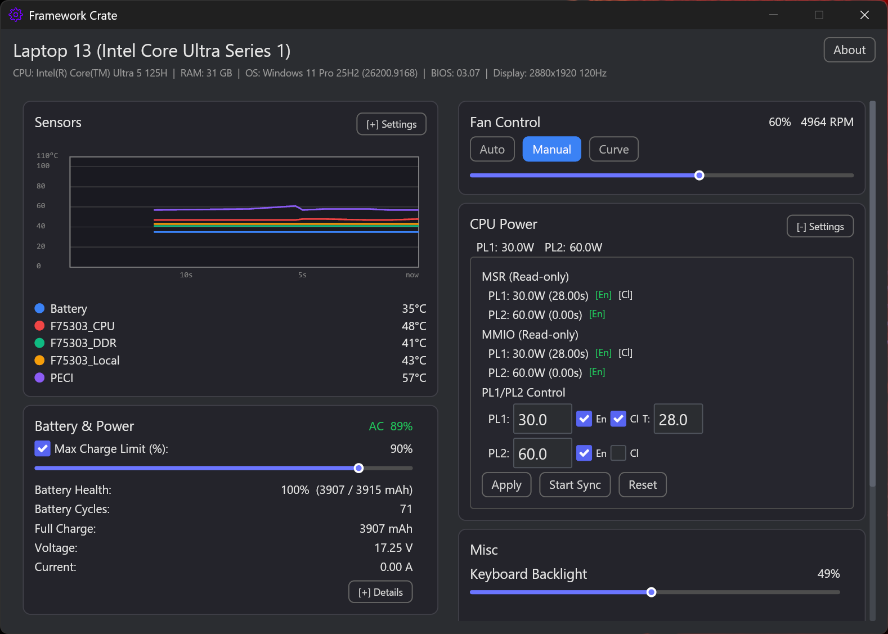
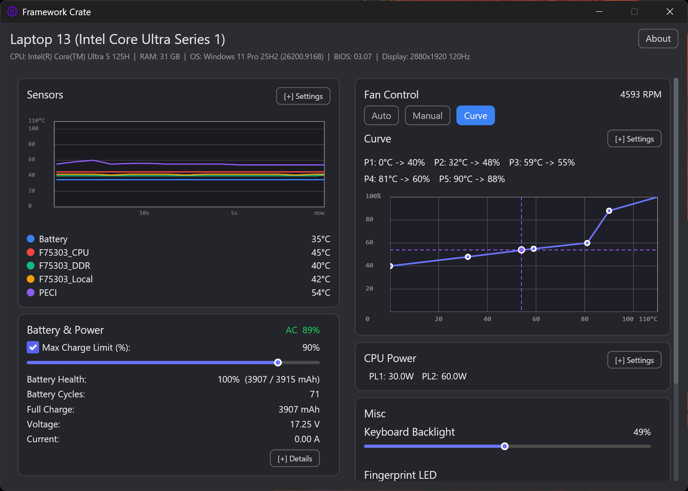

# Framework Crate (Windows)

A native desktop GUI for Framework laptop fan control, battery charge limits, and live hardware telemetry. Built with Rust and [Iced](https://iced.rs/) 0.14, using [`framework_lib`](https://github.com/FrameworkComputer/framework-system) for direct EC hardware access.

Inspired by [ozturkkl/framework-control](https://github.com/ozturkkl/framework-control).

## Downloads

Prebuilt Windows binaries are attached to each [GitHub Release](https://github.com/vincent-chang-rightfighter/Framework-Crate/releases) as `framework-crate.exe`. The release notes list what changed in that version.

Download the `.exe`, then run it as administrator. PawnIO is optional and only needed for the CPU Power card; everything else works with the Framework EC driver alone.

## Screenshot





## Features

- **Fan Control** — Auto (firmware), manual (0–100% duty, optional per-fan), and curve mode with draggable points on a canvas (default 5 points, hysteresis, and rate limiting; live sensor markers shown on the curve)
- **Battery Management** — Maximum charge limit (25–100%) with enable/disable toggle; saved limit is applied on startup. Health uses last-full / design capacity
- **Live Telemetry** — Real-time temperature chart (selectable 15/30/60s window, default 30s), per-sensor display with colored indicators, and fan RPM in the header
- **Misc Panel** — Keyboard backlight slider, fingerprint LED level, expansion card, and USB-C / HDMI / DP port classification
- **CPU Power** — Intel CPUs only. Read/write PL1/PL2 via PawnIO (optional; SHA-256 verified module download); original factory limits are saved on first run for `Reset`. AMD and other vendors are not supported.
- **About Page** — Hardware info (CPU, RAM, display, BIOS), software settings (poll rate, refresh interval, launch at startup), GitHub link, and third-party license notices
- **System Tray** — Minimize to tray, tray icon with context menu (Show / Quit), icon restored automatically if Explorer restarts
- **Launch at Startup** — Registers a per-user logon task so the tray app comes back after a reboot. The task document is generated in-process and handed to `schtasks /Create /XML`; the settings that matter (unlimited execution limit, battery conditions cleared, restart on failure) are asserted by tests without needing elevation
- **File Logging** — Warnings and errors are written to `%APPDATA%/framework-crate/app.log` with size-based rotation, because a logon-launched process has no console to print them to

## Requirements

- **Platform**: Intel Core Ultra Series 1 (Meteor Lake) — only tested and supported on this platform
- Windows 10/11
- Administrator privileges — required for EC access, for writing CPU power limits, and for enabling launch at startup

## Build

```bash
cargo build --release
```

## Binary Size Checks

```powershell
# Debug build (larger because it keeps unoptimized code and full debug symbols)
cargo build
Get-Item .\target\debug\framework-crate.exe | Select-Object Name,Length

# Release build (smaller and suitable for distribution)
cargo build --release
Get-Item .\target\release\framework-crate.exe | Select-Object Name,Length

# Compare debug and release builds in one command
cargo build; Get-Item .\target\debug\framework-crate.exe | Select-Object Name,Length; Get-Item .\target\release\framework-crate.exe | Select-Object Name,Length
```

Notes:

- `debug` builds are intentionally larger because they keep full debug symbols and unoptimized code.
- Use `release` artifacts for packaging and distribution.
- If shipping a bundle, do not include the entire `target/` folder or `.pdb` files unless you need them for debugging.

## Run

```bash
# Must run as administrator
cargo run --release
```

## Architecture

```
src/
  main.rs              — Iced 0.14 application entry point, boot function, rotating file log sink
  app/                 — App struct, Message enum, dispatch, handler submodules
    mod.rs             — App/AppState/Message types, new()/subscription()/update()/view(), update_inner dispatcher
    config.rs          — Config-related message handlers + save/mutate_config helpers
    cpu_power.rs       — CPU power (PL1/PL2) message handlers + input validation
    tray.rs            — Tray message handlers (minimize/restore/quit, power-resume)
    quit.rs            — Quit flow handlers (restore auto/duty fan on exit, flush charge limit)
    tick.rs            — Self-rescheduling UI tick, autosize_task, snapshot rebuild
    misc.rs            — One-off dispatch (settings toggles, debug report, peripheral writes)
    tasks.rs           — Shared async task helpers (run_ec_task, refresh_cpu_power_task, ...)
  sub_state.rs         — AppState groups (fan, thermal, peripherals, battery, system, lifecycle)
  views/               — UI layout split into per-card submodules
    mod.rs             — ViewSnapshot, view_main assembly, shared components
    header.rs          — Top system info header + About button
    sensors.rs         — Temperature sensors, chart settings
    fan_control.rs     — Fan mode, duty slider, curve canvas + settings panel
    cpu_power.rs       — PL1/PL2 control, sync status, MSR/MMIO display
    battery.rs         — Battery info, charge limit section
    misc.rs            — Keyboard backlight, ports section
    settings.rs        — About / Settings popup
    quit_warning.rs    — Quit-before fan state confirmation dialog
  types.rs             — Config structs, FanControlMode, CurveConfig, validation
  style.rs             — Colors, fonts, layout constants
  config.rs            — TOML config load/save (atomic write via tmp+rename, write-through)
  config_save_task.rs  — Debounced config save (100ms) and applies battery settings
  background_task.rs   — EC polling loop, fan control, expansion/PD scans
  cpu_power/           — CPU power (PL1/PL2) via PawnIO, split by concern
    mod.rs             — CpuPowerState and the public forwarding surface
    modules.rs         — PawnIO Modules download, hashing, extraction, install
    limits.rs          — PL1/PL2 encoding, writes, reset to BIOS defaults
    ffi.rs             — PawnIOLib.dll binding and RAPL register access
    sync.rs            — Background sync thread
    bios.rs            — Factory default capture and persistence
    version.rs         — PawnIO / Modules version reporting
    read.rs            — PL1/PL2 reading
  temp_chart.rs        — Canvas-based temperature line chart (selectable history window)
  curve_canvas.rs      — Interactive canvas-based fan curve editor (drag points, sensor markers)
  fan_control.rs       — CurveStepper, rate limiting, duty calculation
  system_info.rs       — Windows API FFI (CPU, RAM, OS, display, tray)
  probe.rs             — HeightProbe widget for dynamic window sizing
  util.rs              — Time utilities, lock helpers (read_lock, with_write_lock), EC/PawnIO timeout guard
  cli/                 — EC wrapper only (not a command-line interface)
    ec_wrapper.rs      — EcClient wrapper around framework_lib's CrosEc
    mod.rs
  tray/
    mod.rs             — TrayManager (Windows tray icon)
    event.rs           — TrayIcon events
    message_pump.rs    — Dedicated message pump thread for tray icon
```

### Data Flow

```
framework_lib (CrosEc) → background_task → Arc<RwLock> → UI (view reads)
                                   ↕
                            config_save_task → config.toml
```

- **Hardware access**: The `framework_lib` crate calls the EC directly via the kernel driver (no subprocess)
- **Config**: `dirs::config_dir() / framework-crate/config.toml`
- **Background polling**: tokio task on LP-E core, 200ms–2s interval (idle slowdown)
- **UI refresh**: self-rescheduling tick (50–1000ms), idle 1s, hidden 2s
- **Lock strategy**: `Arc<RwLock<Arc<T>>>` for shared state, narrow lock scope (<1µs)
- **State organization**: `AppState` split into `FanState`, `ThermalState`, `PeripheralState`, `BatteryState`, `SystemState`, `LifecycleState`, plus `CpuPowerState`

### Performance Optimizations

- `EcClient` is shared via `Arc` — no hardware re-initialization on clone
- `ThermalData.temps` uses `Arc<BTreeMap>` — history samples share data
- `SensorCache.sorted/colors` uses `Arc<Vec>` — zero-copy per UI tick
- Config locks are held for less than 1µs by reading only the needed fields and dropping immediately
- `curve_full_points` is debounced (100ms after the last drag edit)
- PD port history is pushed only when data changes
- The fan curve keeps running during idle periods to maintain temperature response
- The `mutate_config` helper reduces boilerplate for config mutations
- Canvas editor uses cached rendering with content-based invalidation (points, sensor marks, hover/drag state)

### Resource Usage

Measured on `target/release/framework-crate.exe` (Windows, `iced 0.14 + wgpu`, `cargo build --release` with `lto = "fat"` `strip = true`), elevated, on Windows 11 / 31.5 GB RAM / Intel Arc. Mean of 3 launches, 60 s each, sampled once the window had appeared.

| Metric | Value |
|--------|-------|
| Working Set | ~159 MB |
| Private (commit charge) | ~119 MB |
| Binary Size | 9.51 MiB |

Working Set is what Task Manager's Processes **Memory** column shows. To reproduce:

```powershell
$p = Start-Process .\target\release\framework-crate.exe -PassThru
1..20 | ForEach-Object { Start-Sleep 3; $p.Refresh()
  "{0,3}s  workingSet={1,6} MB  private={2,6} MB" -f `
    ($_*3), [math]::Round($p.WorkingSet64/1MB,1), [math]::Round($p.PrivateMemorySize64/1MB,1) }
$p.Kill()
```

## Configuration

Config file location: `%APPDATA%/framework-crate/config.toml`

On first run with PawnIO available, the original factory PL1/PL2 (MSR + MMIO watts, enabled, clamped, time window, and RAPL units) are saved to `%APPDATA%/framework-crate/bios_defaults.toml`. `Reset` in the UI restores this persisted snapshot (the effective `min(MSR, MMIO)`). Delete that file to re-capture the current BIOS values on next launch.

```toml
[fan]
mode = "curve"  # "disabled" | "manual" | "curve"
unified_duty = true
per_fan_duty = []

[fan.manual]
duty_pct = 50

[fan.curve]
poll_ms = 500            # curve polling interval in ms (500–5000)
sensors = []             # empty = hottest non-battery sensor
points = [[30, 0], [45, 20], [60, 40], [75, 80], [85, 100]]  # editable 0–99°C; 100–110°C locked 100%
hysteresis_c = 2
rate_limit_pct_per_step = 10
# optional asymmetric down-rate limit (defaults to rate_limit_pct_per_step if omitted)
# rate_limit_down_pct_per_step = 5

[battery.charge_limit_max_pct]
enabled = true
value = 80

[telemetry]
poll_ms = 500
ui_refresh_ms = 100
selected_sensors = []
```

## Launch at Startup

Toggling **launch at startup** on the About page registers a Windows scheduled task that runs the app at logon. The task is created from a document built in-process and passed to `schtasks /Create /XML`, so every setting is applied atomically in a single call.

| Setting | Value | Why |
|---------|-------|-----|
| `ExecutionTimeLimit` | `PT0S` | The `schtasks` default of `PT72H` silently stops the tray app three days after logon, and it never comes back |
| `DisallowStartIfOnBatteries` / `StopIfGoingOnBatteries` | cleared | A laptop on battery power would otherwise skip or stop the task |
| `RestartOnFailure` | 3 attempts, `PT1M` | The app returns if it crashes during logon |
| Encoding | UTF-16LE with BOM | Task Scheduler rejects a UTF-8 document with a parse error on the XML declaration |
| `Command` / `Arguments` | separate elements | Avoids the argument-splitting failure class of the older `/TR` form |
| `RunLevel` | `HighestAvailable` | The app needs an elevated token for EC access |

Notes:

- **Enabling it requires an elevated process.** The task is registered with `RunLevel=HighestAvailable`, so the app reports a readable message instead of letting `schtasks` emit its localized access-denied text.
- `schtasks` output is decoded using the OEM code page so non-English messages stay readable.
- After creating the task the app queries it back, so success is only reported once the task is actually queryable.
- The task document is written to `%TEMP%` as UTF-16LE and removed afterwards. Because the release profile uses `panic = "abort"`, a process killed mid-write never reaches the removal, so stale documents are cleaned up on the next run.
- The executable path is validated before it is embedded: quotes, cmd metacharacters, control characters, bidi overrides, `DEL` and a trailing backslash are all rejected, since the path is embedded as XML text and wrapped in quotes for the action `Command`.

## Logs

`tracing` output is written to `%APPDATA%/framework-crate/app.log` instead of only stderr, because a logon-launched process has no console — with stderr-only logging every warning and error from an auto-started run was discarded.

The file rotates once it grows past a size threshold, keeping `app.log.1` through `app.log.3`. If the log cannot be opened the app still starts and falls back to stderr.

## Environment Variables

| Variable | Effect |
|----------|--------|
| `RUST_LOG` | Log filter (default `info`); e.g. `RUST_LOG=debug` |
| `FRAMEWORK_CONTROL_CONFIG_DIR` | Overrides the config directory. Must be absolute, with no `..` and no `\\?\` / `\\.\` prefix |
| `FRAMEWORK_ALLOW_UNKNOWN_MODULE_HASH=1` | Loads PawnIO module blobs whose hash is not pinned. Only after manual verification of a newer upstream release |
| `FRAMEWORK_ALLOW_UNSIGNED_PAWNIO=1` | Loads the PawnIO DLL despite an Authenticode failure. For self-signed test DLLs |
| `FRAMEWORK_PIN_CORE=1` | Pins background work to the first enumerated core. Off by default; the OS scheduler is better than the heuristic |

## Known Limitations

- **AMD CPU Power**: CPU Power (PL1/PL2 via PawnIO) is Intel-only. On AMD and other CPUs the card stays visible and shows **Not Supported**; no RAPL / PawnIO access is attempted.
- **Fan Curve Coordinates (resolved in v0.3.0)**: Earlier versions edited curve points with sliders and could leave the canvas axes / line segments misaligned until the next full redraw. v0.3.0 replaced the sliders with direct drag editing on the canvas — points keep their identity when dragged across each other, and the cached rendering invalidates on content changes, so the drawing always matches the numeric points used for fan duty.
- **USB Expansion Card Classification (resolved in v0.3.0)**: Port type (USB-C / USB-A / HDMI / DP) is inferred from EC PD state. Since v0.3.0, ports that ever reported a Sink role are permanently classified as USB-C, so USB-C vs USB-A is no longer flipped when a device is plugged into an expansion-card port. HDMI/DP cards that omit DP-alt may still be mislabeled — use Expansion Card Debug Mode on the About page to inspect raw role / watts.
- **Sleep / Hibernate Fan Control (resolved in v0.3.0)**: Previously, fan-speed control could stop responding correctly after the system resumed from sleep or hibernation. v0.3.0 detects `WM_POWERBROADCAST` resume events (resetting the EC client, `CurveStepper` state, and thermal history) and additionally re-asserts the fan duty every 30 s, so the fans spin back up even if the resume event is missed. Consecutive EC read / write failures also trigger automatic client reinitialization.
- **Platform-specific**: This project has only been tested on Intel Core Ultra Series 1 (Meteor Lake) Framework laptops; broader support is not yet guaranteed.
- **EC driver**: The Framework EC kernel driver must be installed for `framework_lib` to communicate with the hardware.
- **Crash leaves last-applied state**: orderly quit restores firmware fan control and flushes the charge limit, but a crash or kill bypasses that path, so the EC keeps the last written fan duty until sleep, reboot, or the next launch re-asserts it.

## Third-Party Dependencies

- [`framework_lib`](https://github.com/FrameworkComputer/framework-system) — Framework EC hardware abstraction layer (from [framework-system](https://github.com/FrameworkComputer/framework-system))
- [`iced`](https://crates.io/crates/iced) — Cross-platform GUI framework for Rust
- [`PawnIO`](https://github.com/namazso/PawnIO) — Kernel-level hardware access driver (GPL-2.0), installed via `winget install namazso.PawnIO`
- [`PawnIO Modules`](https://github.com/namazso/PawnIO.Modules) — Pre-compiled module blobs for MSR and MMIO access (LGPL-2.1)

## CPU Power Feature (PawnIO Modules)

The CPU Power section is **Intel-only** (CPUID vendor `GenuineIntel`). On AMD or other CPUs the card shows Not Supported and no PawnIO / MSR access is attempted.

The section reads and optionally writes PL1/PL2 via official PawnIO Modules. Those blobs are **not** in this repository and are **not** embedded in the EXE.

1. Install the PawnIO driver: `winget install namazso.PawnIO` (or use **Install PawnIO** in the app).
2. Open **CPU Power** and click **Download Modules**.
3. The app fetches `IntelMSR.bin` and `IntelMCHBAR.bin` from [PawnIO Modules Releases](https://github.com/namazso/PawnIO.Modules/releases) (latest, falling back to 0.2.11 when the GitHub API is unreachable), checks SHA-256 (enforced) and caches them in `%APPDATA%/framework-crate/modules/`.

A missing file blocks CPU Power; a hash mismatch also blocks use — update the app for the new release, or set `FRAMEWORK_ALLOW_UNKNOWN_MODULE_HASH=1` only after manual verification. Failed download shows manual instructions: download latest `release_*.zip` from the releases page and place `IntelMSR.bin` + `IntelMCHBAR.bin` into `%APPDATA%/framework-crate/modules/`. Use **Open Modules Folder** and **Redetect** in the UI to verify — no restart needed.

The first successful RAPL read also persists the original factory limits to `bios_defaults.toml` (see Configuration). `Reset` and resume-from-sleep both restore `min(MSR, MMIO)` from that snapshot.

**Requirements:**
- PawnIO installed
- Internet connection for the first download (or place the module files manually — see above)

**LGPL-2.1 Compliance:**

PawnIO Modules are LGPL-2.1. This project does not ship the blobs. Source: https://github.com/namazso/PawnIO.Modules (latest, currently 0.2.11)

## Icon Attribution

The application icon is the "settings" icon (System category) from the [Iconoir](https://iconoir.com/) icon set, licensed under the [MIT License](https://github.com/iconoir-icons/iconoir/blob/master/LICENSE).

Rendering parameters: optical size 32, stroke weight 1.5, color `#7300ff` (R 115, G 0, B 255). The source SVG (`assets/settings.svg`) is reproduced with attribution to Iconoir.

## Development

This project is developed with AI coding agents (pair-programming / review / refactor assistance). Design decisions, hardware behavior, and releases are reviewed and owned by the maintainer.

## License

MIT

This project uses PawnIO (GPL-2.0) and PawnIO Modules (LGPL-2.1) at runtime. PawnIO is an optional, separately installed driver. PawnIO Modules are downloaded only when the user clicks **Download Modules** in the app; they are never stored in this repo or the EXE. `framework_lib` is BSD-3-Clause. PawnIO Modules source: https://github.com/namazso/PawnIO.Modules.
